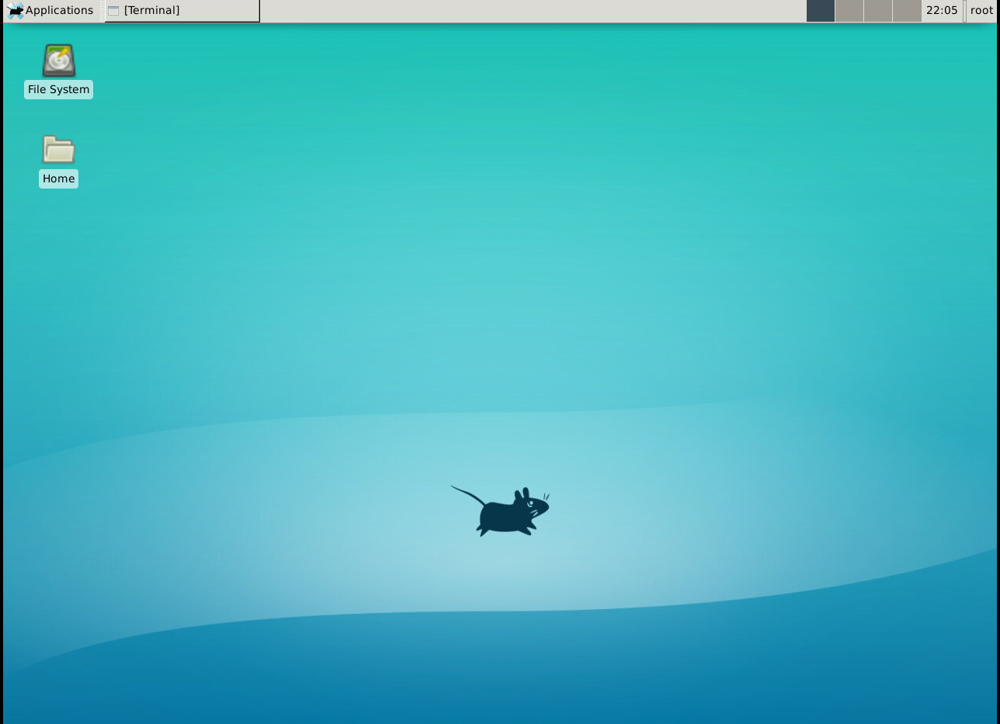

# Docker - XFCE4 

# Inspiration

I needed a docker image to execute Selenium, 
the target site used Cloudflare  and Cloudflare has anti-robots
I tried to use different approaches but they did not work.

When I executed it in my local environment selenium worked without any problem, but when  I tried to execute selenium in --headles again did not work in my local environment which was strange.

I said,  I needed to see the execution in the server so I installed vnc, Google Chrome, and XFCE because is a simple desktop.

When I tried to open the target site, Cloudflare did not say anything.
That is the reason I searched in GitHub, for examples of xfce4 and docker, after I found the candidate.

I added xvfb to docker image, Xvfb or X virtual framebuffer so I executed the selenium script inside xvfb.

Until the moment I don't have any problem.

# Download
https://github.com/starsaminf/docker-xfce/pkgs/container/docker-xfce

# Screenshot  

### Happy Hacking :)
